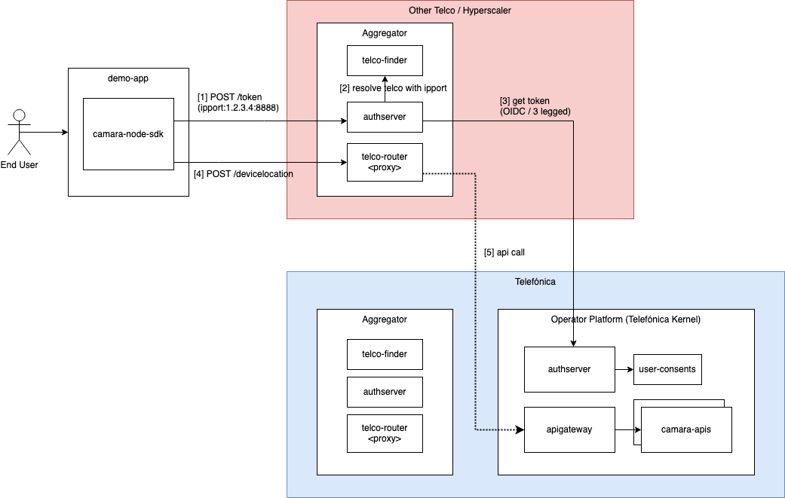

# opengateway-aggregation-poc

OpenGateway proof of concept. It demonstrates how an aggregator (e.g., hyperscaler, operator) can receive requests from an end user / application and forward them to the appropriate operator just using standard OIDC flows and regular CAMARA API calls.



## How to run it

To run the environment, you only need to have Docker installed.

### Create the environment

Execute in your terminal the following command (Docker is required):

```sh
docker-compose up --build
```

That starts a demo app and **two aggregators**:
1. Telefónica
2. Vodafone acting as aggregator for the developer. This means that it is the only point of contact for the app.

Now you can open the **demo-app** at http://localhost:3000 and simulate an app wants to call the Device Location Verification API for end users that are clients of Telefónica or Vodafone.

# License

Copyright 2023 Telefonica Investigación y Desarrollo, S.A.U

Licensed under the Apache License, Version 2.0 (the "License"); you may not use this file except in compliance with the License. You may obtain a copy of the License at

http://www.apache.org/licenses/LICENSE-2.0

Unless required by applicable law or agreed to in writing, software distributed under the License is distributed on an "AS IS" BASIS, WITHOUT WARRANTIES OR CONDITIONS OF ANY KIND, either express or implied. See the License for the specific language governing permissions and limitations under the License.
